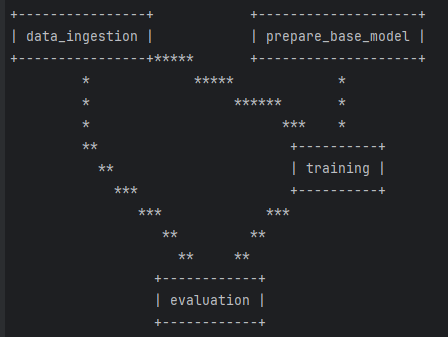

# se489_group_project

# Kidney Disease diagnosis DL model

## Project structure

The directory structure of the project looks like this:

```txt

├── Makefile             <- Makefile with convenience commands like `make data` or `make train`
├── README.md            <- The top-level README for developers using this project.
├── data
│   ├── processed        <- The final, canonical data sets for modeling.
│   └── raw              <- The original, immutable data dump.
│
├── docs                 <- Documentation folder
│   │
│   ├── index.md         <- Homepage for your documentation
│   │
│   ├── mkdocs.yml       <- Configuration file for mkdocs
│   │
│   └── source/          <- Source directory for documentation files
│
├── models               <- Trained and serialized models, model predictions, or model summaries
│
├── notebooks            <- Jupyter notebooks.
│
├── pyproject.toml       <- Project configuration file
│
├── reports              <- Generated analysis as HTML, PDF, LaTeX, etc.
│   └── figures          <- Generated graphics and figures to be used in reporting
│
├── requirements.txt     <- The requirements file for reproducing the analysis environment
|
├── requirements_dev.txt <- The requirements file for reproducing the analysis environment
│
├── tests                <- Test files
│
├── se489_group_project  <- Source code for use in this project.
│   │
│   ├── __init__.py      <- Makes folder a Python module
│   │
│   ├── data             <- Scripts to download or generate data
│   │   ├── __init__.py
│   │   └── make_dataset.py
│   │
│   ├── models           <- model implementations, training script and prediction script
│   │   ├── __init__.py
│   │   ├── model.py
│   │
│   ├── visualization    <- Scripts to create exploratory and results oriented visualizations
│   │   ├── __init__.py
│   │   └── visualize.py
│   ├── train_model.py   <- script for training the model
│   └── predict_model.py <- script for predicting from a model
│
└── LICENSE              <- Open-source license if one is chosen
```

Created using [cookiecutter template](https://github.com/cookiecutter/cookiecutter) for getting
started with Machine Learning Operations (MLOps).

### STEP 01- Create a conda environment after opening the repository

```bash
conda create -n grp_env python=3.8 -y
```

```bash
conda activate 
```

```bash
pip install -r requirements.txt
```

```bash
# Finally run the following command
python app.py
```

Now,
```bash
open up you local host and port
```

##### cmd (to check your model on mlflow ui without logging to dagshub/mlflow remote)
- mlflow ui

### dagshub

Run this to export as env variables:

```bash

export MLFLOW_TRACKING_URI= https://dagshub.com/RobinMacwan/group_project_se489.mlflow

export MLFLOW_TRACKING_USERNAME=RobinMacwan

export MLFLOW_TRACKING_PASSWORD= <available upon request>

```

### DVC cmd for looking up code dependancy 

1. dvc init
2. dvc dag

for example 


### REFERENCES/Citation

#[1] Model used : Vgg16 - https://keras.io/api/applications/vgg/

#[2] Test Data: CT Kidney dataset : https://www.kaggle.com/datasets/nazmul0087/ct-kidney-dataset-normal-cyst-tumor-and-stone/code

#[3] Code help: https://github.com/malleswarigelli/Chest_Disease_Image_Classification_


