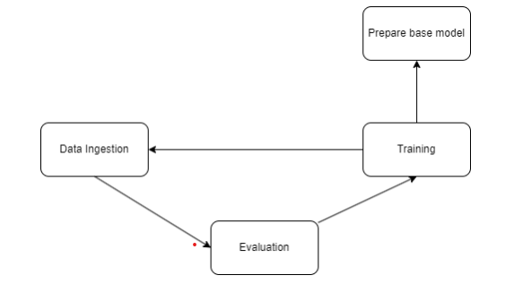
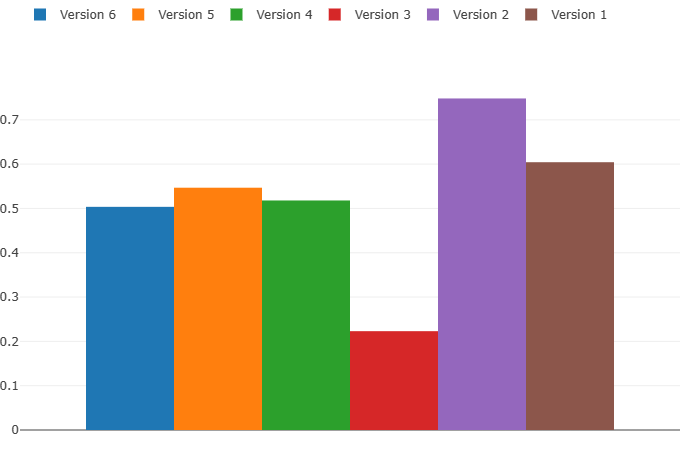
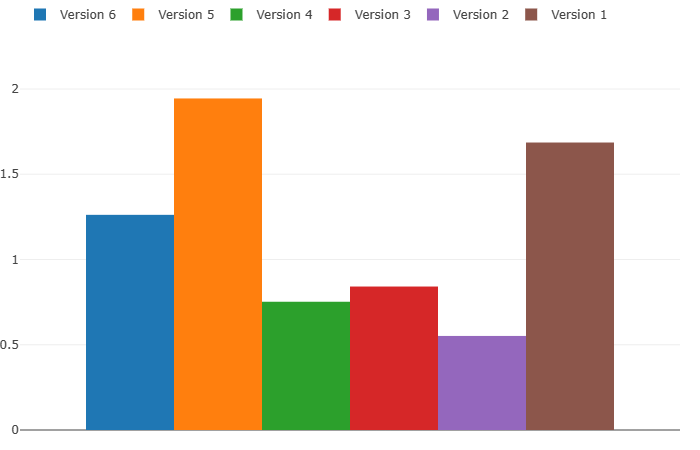
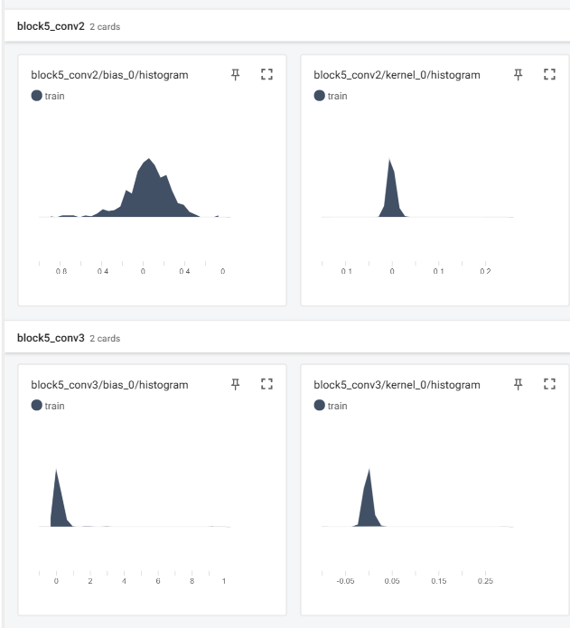
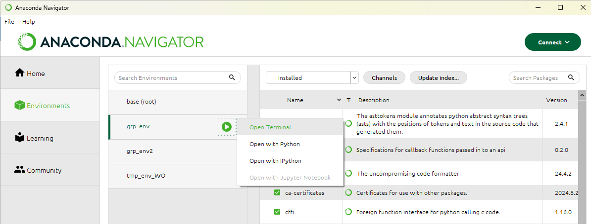

## Documentation

###Project Description

The project aims to develop a deep learning model using the [1] VGG16 architecture to detect kidney tumors in CT scans. The model will be trained on the [2] CT Kidney Dataset, which contains images of normal kidneys and kidneys with tumors. By leveraging the VGG16 model's ability to extract intricate features from images, the goal is to create a reliable tool for early detection of kidney tumors, aiding in timely medical interventions and improved patient outcomes.

###Technology Stack
| Technology       | Description                                      |
|------------------|--------------------------------------------------|
| Cookiecutter     | File structure template                          |
| GitHub           | Version control platform                         |
| DVC              | Data version control tool                        |
| MLflow           | Model tracking and comparison                    |
| Docker           | Containerization tool for model deployment       |
| AWS              | Cloud hosting service for web interfaces         |
| Keras            | User-friendly deep learning library              |
| Jupyter Notebook | Interactive development and experimentation tool|
| TensorFlow       | Deep learning framework for model development    |

###Data Preparation

####Preprocessing

ImageDataGenerator class from TensorFlow/Keras is utilized to preprocess image data. The following steps occur during preprocessing:

- Image Rotation (rotation_range=40):
    - Images are randomly rotated within a 40 degree range.

- Horizontal Image flip (horizontal_flip=True):
    - Images are flipped left to right.

- Width Shift (width_shift_range=0.2):
    - The total width of the image is shifted within a 20% range.

- Height Shift (height_shift_range=0.2):
    - The total height of the image is shifted vertically within a 20% range.

- Shearing Transformation (shear_range=0.2):
    - Images undergo shearing transformation within a 20% range.

- Zoom Transformation (zoom_range=0.2):
    - Images are scaled up or down within a 20% range.

- Additional Parameters (**datagenerator_kwargs):
 Extra parameters are specified and passed to the Image Data Generator for further customization. Extra parameters include:

- Rescaling Image: Image is normalized to ensure that the input data is suitable for neural network processing.

- Image Resizing: all images are resized before being fed to the model.

- Interpolation: Bilinear interpolation provides smooth resizing.

##Model Training Process

####Loading Configuration

Configuration files are loaded. These files contain parameters for training, such as the number of epochs, batch size, etc.

####Configuration Manager

The configuration manager class is used to retrieve the training configuration

####Training Class Initialization

Instance of Training class is created via the retrieved training configuration

####Loading Base Model

get_base_model() method within the training class loads the pre-trained model.

####Data Generator Setup

The train_valid_generator() method is used to set up the data generators for training and validation data. The generator is responsible for loading and preprocessing data batches during training.

####Model Training

Within the training class the train method is called to train the model. Within the method the following steps are completed:

The number of steps per epoch and validation steps are calculated based on the size of the training and validation datasets and the batch size.

The model is trained utilizing the fit() method of the TensorFlow Keras Model. The process includes:

  - training loop based on number of epochs
    - The data generator provides batches of data for each epoch.
    - The model computes predictions, compares them to labels,
    calculates the loss, and adjust the weights using backpropagation.
  - The model is evaluated on the validation generator. This computes the validation loss and accuracy. This gives the measure of generalization.

The training data generator is utilized to supply training data to the model in batches.

Model’s performance is evaluated at the end of each epoch with validation data

####Trained Model

The save_model() method is used to save the trained model to disk

##Summary
###	 Figure 1. DVC Lifecycle

###VGG16  Overview
- Consists of 16 weight layers:
  -13 convolutional layers
  -3 connected layers
- Utilizes 3x3 convultion filters throughtout the network
-Follows a consistent pattern hwere convolution layers are grouped into blocks, followed by max-pooling layers.

Our initial approach involved basic hyperparameter tuning, where we
manually adjusted the hyperparameters of our base model to achieve
optimal accuracy. We began by experimenting with the learning rate. This is the most
influential hyperparameter.

##Findings

###BASE MODEL METRICS

#### MODEL: Version 1 (EPOCHS: 1, IMAGENET WEIGHTS, BATCH SIZE: 16, LEARINING RATE: 0.01)
| TRAINING LOSS | TRAINING ACCURACY | VALIDATION LOSS | VALIDATION ACCURACY |
|---------------|-------------------|-----------------|---------------------|
| 11.5746       | 0.5843            | 1.8901          | 0.4875              |

#####INITIAL MODEL OBSERVATIONS

- Training Loss: high value indicates that the model is struggling to learn the patterns in the training data.
- Training Accuracy: model is getting around 58.43% of the predictions right on the training data
- Validation Loss: th validation loss is significantly lower than the training loss. This may indicate some overfitting in the model's learning.
  -Overfitting: means that the model is failing to generalize beyond the specific patterns of the training set.
- Validation Accuracy: the accuracy is about 48.75%. This indicates that the model is performing worse on unseen data.

### FINE-TUNING HYPERPARAMETERS (Learning Rate -0.001)
Utilizing the params.yaml file. We are able to manually fine tune are hyperparameters individually

#### MODEL: Version 2 (EPOCHS: 1, IMAGENET WEIGHTS, BATCH SIZE: 16, LEARNING RATE: 0.001)
| TRAINING LOSS | TRAINING ACCURACY | VALIDATION LOSS | VALIDATION ACCURACY |
|---------------|-------------------|-----------------|---------------------|
| 0.9631        | 0.6039            | 0.5717          | 0.7375              |

##### OBSERVATIONS
- Training Loss: Drastically reduced from 11.5746 to 0.9631. This suggests that the decreased learning rate made the modern far more efficient at minimizing errors during training.
- Validation Loss: This also decreased as well. It went from 1.8901 to 0.5717
  - The model performs better on unseen data
- Training Accuracy: Increased from 58.43% to 60.39%.
- Validation Accuracy: Went from 48.75% to 73.75%. This is a dramatic improvement.
  - This means that the model performs better on unseen datasets. This is important for real-world applciatons

### FINE-TUNING HYPERPARAMETERS (Learning Rate -0.0001)
#### MODEL: Version 3 (EPOCHS: 1, IMAGENET WEIGHTS, BATCH SIZE: 16, LEARNING RATE: 0.0001)

| TRAINING LOSS | TRAINING ACCURACY | VALIDATION LOSS | VALIDATION ACCURACY |
|---------------|-------------------|-----------------|--------------------|
| 0.7090        | 0.5421            | 0.9139          |    0.1375          |

#### OBSERVATIONS

- Training Loss: Training loss is lower.
- Training Accuracy: The accuracy of this model is the lowest out of all three.
- Validation Loss: The validation loss increased in this model.
    - However, it is not generalizing the dataset as well as the second model.
- Validation Accuracy: Dramatically decreased. This model is performing poorly on unseen data.

Based of these metrics the learning rate will remain at 0.001.

### FINE-TUNING HYPERPARAMETERS (Batch Size: 32)

#### MODEL: Version 4 (EPOCHS: 1, IMAGENET WEIGHTS, BATCH SIZE: 32, LEARNING RATE: 0.001)

| TRAINING LOSS | TRAINING ACCURACY | VALIDATION LOSS | VALIDATION ACCURACY |
|---------------|-------------------|-----------------|---------------------|
| 1.1084        | 0.5941            | 0.5840          | 0.7500             |

Based on these metrics model 2 is performing better than this model as well.
However, the validation accuracy is higher for this model. This means that the number of
Epochs may need to be increased. To verify which batch size performs better for our model. Both
will be tested.

#### MODEL: Version 5 & 6 (EPOCHS: 2, IMAGENET WEIGHTS, BATCH SIZE: 16, 32, LEARNING RATE: 0.001)

| Epoch | Batch Size   | TRAINING LOSS   | TRAINING ACCURACY   | VALIDATION LOSS   | VALIDATION ACCURACY   |
|-------|--------------|-----------------|---------------------|-------------------|-----------------------|
| 1     | 16           | 1.2175          | 0.5562              | 1.2346            | 0.4375                |
| 2     | 16           | 0.4491          | 0.7893              | 2.2818            | 0.4750                |

| Epoch | Batch Size   | TRAINING LOSS   | TRAINING ACCURACY   | VALIDATION LOSS   | VALIDATION ACCURACY   |
|-------| ------------ | --------------- | ------------------- | ----------------- | --------------------- |
| 1     | 32           | 1.1818          | 0.5353              | 0.5466            | 0.7500                |
| 2     | 32           | 0.8903          | 0.5706              | 1.7596            | 0.3281                |

The results show that 1 Epoch, Batch Size 32 should be explored further.
- It has the highest validation accuracy overall.
  - Early Stopping can be utilized to capture the model state before degradation
  - The learning rate can be readjusted
  - Regularization can be implemented to stabilize training and prevent overfitting

#### OVERALL METRICS PER MODEL

Overall Model Accuracy Bar Graph

Overall Model Loss Bar Graph

| Name             | Accuracy | Loss  |  Learning Rate | Epochs |
|------------------|----------|-------|---------------|--------|
| Version 1        | 0.604    | 1.686 |      0.01     | 1      |
| Version 2        | 0.748    | 0.552 |      0.001    | 1      |
| Version 3        | 0.223    | 0.841 |      0.0001   | 1      |
| Version 4        | 0.518    | 0.752 |      0.001    | 1      |
| Version 5        | 0.547    | 1.944 |      0.001    | 1      |
| Version 6        | 0.504    | 1.262 |      0.001    | 1      |

####Challenges

- Initial Setup Challenges: Coordinating the multiple components involved in the project, such as DVC, GitHub, DAGsHub, Python, PyTorch, and MLFlow, can be challenging. Ensuring smooth integration and setup of these tools requires careful planning and synchronization.

- IDE Challenges: Visual Studio Code didn't perform as effectively as PyCharm. PyCharm provided all the necessary features for working with Python and all of the dependencies that were needed to run the project.

####Areas Of Improvement

There are still hyperparameters that we can fine tune to improve our model. Such as:

- Using an optimizer to experiment with optimizer parameters
- Using regularization techniques
- etc..

#cProfiler
##Overview
cProfiler was integrated into our existing Workflow and Jupyter Notebooks . It provided detailed statistics about function calls. We were able to make improvements to some of our functions with the
utilaztion of asynchronous operations, manage pool workers with ThreadPoolExecuter, etc....  The test were performed in Jupyter Notebook and later added to the ourk workflow. Workflow was verified using curl to trigger training endpoint.

##Performance Testing and Metrics From cProfiler
To evaluate the performance imact of the changes, we measured different functions before and after the optimizations.

##Comparison Before and After Optimization Of Data Ingestion

|Function     |Before Optimization     |After Opitimization    |Difference   |
|-------------|------------------------|-----------------------|-------------|
|download_file|13.2                    |9.55                   |-3.65        |
|download     |13.2                    |9.54                   |-3.66        |
|generate     |12.0                    |8.60                   |-3.40        |
|stream       |12.0                    |8.60                   |-3.40        |
|read         |12.0                    |8.60                   |-3.40        |
|_raw_read    |11.9                    |8.57                   |-3.33        |
|_fp_read     |11.9                    |8.56                   |-3.34        |
|read         |11.9                    |8.56                   |-3.34        |
|readinto     |11.9                    |8.51                   |-3.39        |
|read         |11.9                    |8.51                   |-3.39        |

##Analysis of Results
The results from the profiling shows a consistent overall decrease execution time across
different functions in the data ingestion process. This is indicative of a reduction of overhead
and efficency improvement.

##Comparison Before and After Optimization Of Prepare Base Model

|Function      |Before Optimization     |After Opitimization    |Difference   |
|--------------|------------------------|-----------------------|-------------|
|get_base_model|1.48                    |0.529                  |-0.951       |
|VGG16         |1.39                    |0.528                  |-0.862       |
|get_file      |0.945                   |0.121                  |-0.824       |
|validate_file |0.944                   |0.120                  |-0.824       |
|_hash_file    |0.944                   |0.944                  |-0.120       |

##Analysis of Results
We were able to consistently decrease the excution time for prepare base model as well. We
implemeneted async functions.

##Comparison Before and After Optimization Of Model Training

|Function      |Before Optimization     |After Opitimization    |Difference   |
|--------------|------------------------|-----------------------|-------------|
|train         |38.1                    |32.7                   |-5.4         |
|error_handler |38.6                    |33.2                   |-5.4         |
|fit           |38.0                    |32.5                   |-5.5         |
|evaluate      |6.74                    |6.21                   |-0.53        |
|_call_        |35.8                    |30.5                   |-5.3         |

##Analysis of Results
We were able to consistently decrease the excution time for prepare mase model as well. We
implmeneted async functions.

##Comparison Before and After Optimization Of Model Evaluation

|Function       |Before Optimization     |After Opitimization    |Difference   |
|---------------|------------------------|-----------------------|-------------|
|log_into_mlflow|64.6                    |72.5                   |-0.951       |
|log_model      |63.5                    |71.3                   |-0.862       |
|log            |63.5                    |71.3                   |-0.824       |
|log_artifacts  |60.2                    |60.2                   |-0.824       |
|http_request   |61.9                    |60.2                   |-0.120       |

##Analysis of Results
For the final part we actually noticed an increase in performance time after optimizations. Therefore, we decided to keep the original code.

#TensorBoard Profiling
##Overview
We utilized Tensorflow Profiler instead of PyTorch Profiler because it was more compatiable with
our codebase. The Tensorboard is automatically started in the code for the user. The following are the results. Historgrams in Tensorboard visualize the distribution of weights, biases, and other tensors during trining of the neural network

##Model 1 (Part 2)
###Overfitting In Block 5

Analyzing the histograms provided by the tensorflow profiler provided us with invaluable information. We decided to start with the original model and work from there. The histograms
analyzed each block and convolution. Block4 showed more peaked distributions. This suggest either more focused learning or potential overfitting. During the final Block5 It shows the kernal histogram had a sharp peak and the bias histogram had little spread. So, once again we decided to adjust the learning rate.

##Model 2 (Part 2)

With the newly adjusted the model the earlier layers still show a broder distribution with the kernal
histograms. However, once again in block5 the distribution is narrower and with sharper peaks. With
the bias histograms the earlier layers are around zero. This is expected. However, once again in the deeper layers the distributions become more peaked. This is indicatie of fine tuning to specific values. With these new tools we were able to pinpoint that we should try regularization techniques. As well as dropping the learning rate once more.

##Model 3 (Part 2)
We then decided to implemnt batch normalization to help with optimization. This helps with better training and potentially the reduction of overfitting. Utilizaing batch normalization
drastically improved our models accuracy and loss. However, our model is still overfitting in block 5 according to the historgrams provided by tensorflow.

###Model Accuracy (Part 2)
| Name             | Accuracy | Loss  |  Learning Rate | Epochs |
|------------------|----------|-------|---------------|--------|
| Version 1_Part 2 | 0.547    | 15.02 |      0.01     | 1      |
| Version 2_Part 2 | 0.871    | 0.575 |      0.001    | 1      |
| Version 3_Part 2 | 0.928    | 0.393 |      0.001    | 1      |

###Model Accuracy (Part 3 Update)
I had to redo some of the code in part 3. I think some of the code was not saved on my initial push. However, I was able to get it back to 92% accuracy by fixing the missing code. I also added momentum to our base model. After doing a little research I found that adding momentum works well with the Optimizer that we are utilizing. The final model is 95% accurate with  0.197.

##Monitoring and Debugging

##Pre-Commit
To add pre-commit you will need to add it as an adminstrator. This will avoid any incompablity issues or errors. From the Anaconda Navigator open the command line. 

From there go to the directory that contains the requirements.txt file.
Run the pip install -r requirements.command

##Dags Hub Repo and MLflow Links

###MLFlow Reports
##
https://dagshub.com/eTroupe5201/GroupProjectSE489.mlflow/#/experiments/0?searchFilter=&orderByKey=attributes.start_time&orderByAsc=false&startTime=ALL&lifecycleFilter=Active&modelVersionFilter=All+Runs&datasetsFilter=W10%3D

###Experiments
The following is a link to the experiments for our project. It contains different graphs and reports from mlflow.
https://dagshub.com/eTroupe5201/GroupProjectSE489/experiments/#/

###Repo (mirrored from original repo)
https://dagshub.com/eTroupe5201/GroupProjectSE489

###Appendix I: References

[1] VGG16. Retrieved from VGG16 and VGG19 (keras.io)

[2] CT KIDNEY DATASET: Normal-Cyst-Tumor and Stone. Retrieved from CT KIDNEY DATASET: Normal-Cyst-Tumor and Stone (kaggle.com)
